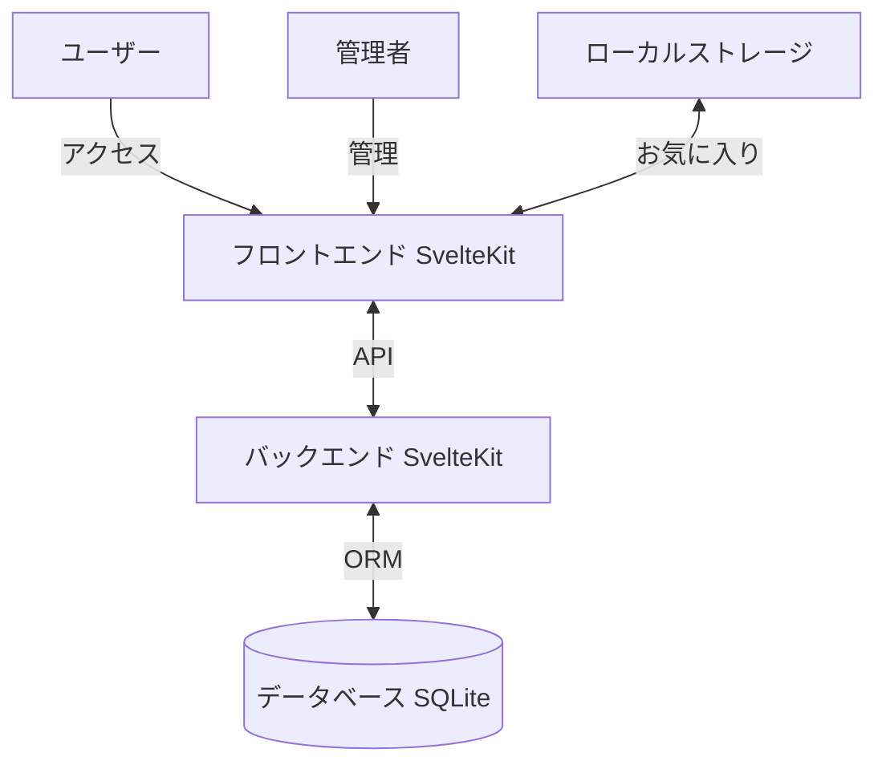

# 1. 背景と目的

- このアプリケーションは、管理者が空想のアーティストと楽曲を手動で追加し、公開・共有できるWebサイトを提供します。
- 対象ユーザーは、新しい音楽との出会いを求める音楽ファンです。

## システムアーキテクチャ

---

# 2. 機能要件

## 2.1 管理画面ログイン機能
- **機能概要**：管理者がシークレットキーの完全一致で管理画面にログインします。

## 2.2 アーティスト追加機能
- **機能概要**：管理者がアーティスト名、プロフィール、画像などを手動で追加します。

## 2.3 アーティスト編集機能
- **機能概要**：管理者が既存のアーティスト情報を編集します。

## 2.4 曲の追加機能
- **機能概要**：管理者がアーティストに紐づく曲を手動で追加します。

## 2.5 曲の編集機能
- **機能概要**：管理者が既存の曲情報を編集します。

## 2.6 曲の再生機能
- **機能概要**：ユーザーが公開された曲を再生し、基本的な音楽プレイヤー機能を提供します。
- **再生ウィジェット**：管理画面以外の全ページで常に表示され、再生状態を維持します。

## 2.7 お気に入り機能
- **機能概要**：ユーザーが曲をお気に入りに追加し、ブラウザのローカルストレージに保存します。データベースには保存しません。
- **詳細**：お気に入りモジュールを使用して、お気に入りの追加、削除、取得を行います。`localStorage`を利用して、曲IDを保存します。

## 2.8 ユーザー操作に対するフィードバック
- **機能概要**：ユーザー操作に応じて適切なフィードバックを提供します。

---

# 3. 非機能要件

- **対応デバイス**：PCのみ対応（最新のデスクトップWebブラウザ）
- **ログイン機能**：ユーザーのログイン機能は不要
- **UIデザイン**：必ずTailwind CSSを利用して、CSSのスタイルは直接記述しない
  - 色、フォント、ボタンスタイルの統一
  - 視覚的な階層構造の明確化
  - **要素の背景色**：要素の背景色は`bg-gray-800`を使用
  - **ページの背景色**：ページ全体の背景色は`bg-gray-700`を使用
- **アクセシビリティ要件**：
  - キーボード操作への対応
- **ファイルアップロード処理**:
  - 画像、音声ファイルは/static/upload/ディレクトリ直下に保存することで実現する
- **APIのリクエスト形式**：APIはすべてFormData形式で行うこと

---

# 4. 制約事項

- **フロントエンド**：HTML5, CSS3, JavaScript, SvelteKit
- **バックエンド**：SvelteKit (Bun)
- **データベース**：SQLite
- **ORM**：Prisma
- **開発環境**：ローカル環境で動作
- **セキュリティ対策**：本アプリケーションは書籍で利用するサンプルアプリケーションであるため、利用するライブラリで常識的に対応できる範囲以上のセキュリティ対策は行わない。
- **データベース仕様**：画像や音声ファイルはURLではなく、ファイルシステム上のパスのみをデータベースに保存します。
- **画像保存ディレクトリ**：画像ファイルは`./static/uploads/`ディレクトリに保存します。
- **SVGコード保存ディレクトリ**：SVGコードは`docs/svg/`フォルダに保存されます。
---

# 5. ユースケース

## 5.1 管理者が管理画面にログインし、新しいアーティストを追加する
- **操作手順**：
  1. シークレットキーを入力し、ログインボタンをクリック
  2. 管理ダッシュボードで「アーティスト追加」ボタンをクリック
  3. アーティスト情報を入力し、「保存」ボタンをクリック
- **フィードバック**：
  - ログイン失敗時にエラーメッセージを表示
  - 保存成功時に「アーティストが追加されました」という通知を表示

## 5.2 管理者が既存のアーティストに新しい曲を追加する
- **操作手順**：
  1. 管理ダッシュボードで対象のアーティストを選択
  2. 「曲追加」ボタンをクリック
  3. 曲情報を入力し、「保存」ボタンをクリック
- **フィードバック**：
  - 入力エラー時にエラーメッセージを表示
  - 保存成功時に「曲が追加されました」という通知を表示

## 5.3 管理者が既存のアーティストや曲を編集する
- **操作手順**：
  1. アーティストまたは曲一覧から対象を選択
  2. 「編集」ボタンをクリック
  3. 情報を更新し、「保存」ボタンをクリック
- **フィードバック**：
  - 更新成功時に「情報が更新されました」という通知を表示

## 5.4 ユーザーがWebサイトで新しい音楽を発見し、曲を再生する
- **操作手順**：
  1. トップページで興味のある曲の「再生」ボタンをクリック
  2. 再生ウィジェットで再生・一時停止を行う
- **フィードバック**：
  - 再生開始時に再生ウィジェットに曲情報を表示
  - ページ遷移しても再生が継続し、ウィジェットが表示され続ける

## 5.5 ユーザーが気に入った曲をお気に入りに追加し、後で再生する
- **操作手順**：
  1. 曲の「お気に入りに追加」ボタンをクリック
  2. お気に入りページで曲を選択し、再生ボタンをクリック
- **フィードバック**：
  - 追加成功時に「お気に入りに追加されました」という通知を表示
  - お気に入りから曲を削除する際に確認メッセージを表示

---
# 6. 必要ページ一覧（共通要素を含む）
## 6.0 共通要素
### 6.0.1 ヘッダー
  - **概要**: 全ページに表示されるヘッダー
  - **UIコンポーネント**
    - ロゴ(🚀の絵文字のみ。クリックするとトップページへ遷移)
    - グローバルナビゲーションメニュー（ホーム、お気に入りへのリンクのみ）
### 6.0.2 再生ウィジェット
- **概要**: ユーザーが曲を再生・一時停止操作を行うためのウィジェット。再生状態、曲情報、再生時間、音量を管理し、ユーザーに視覚的なフィードバックを提供します。
- **デザイン**
- 全体のレイアウト：
  - 画面下部に固定され、全幅、ダークグレーの背景（bg-gray-800）に白いテキスト。
  - パディングされたコンテンツ（p-4）をフレックスレイアウトで配置し、アイテムを中央に配置し、間隔を均等にします。
- 曲情報（左）：
  - 16x16ピクセルのアルバムアート画像。
  - 大きく太字のフォントで曲のタイトルを表示し、画像の右側にアーティスト名を小さなフォントで表示します。
- 再生コントロール（中央）：
  - 円形の再生/一時停止ボタン（白い背景、ダークグレーのアイコン）。
  - ボタンは再生（右向きの三角形）と一時停止（2本の縦線）のアイコンを切り替えます。
- 進行バー（コントロールの隣）：
  - 時間表示："M:SS / M:SS"形式。
  - 薄い（h-1）進行バー、幅40ユニット：
    - グレーの背景（全体の時間）。
    - 白い前景（現在の位置）。
- 音量コントロール（右）：
  - スピーカーアイコン（SVG）。
  - 水平の音量スライダー、幅20ユニット。
- **UIコンポーネント**：
  - 曲名表示: 現在再生中の曲のタイトルを表示します。
  - アーティスト名表示: 現在再生中の曲のアーティスト名を表示します。
  - アートワーク表示: 現在再生中の曲のアルバムアートを表示します。再生されていない状態ですは/img/song_default.webpを表示する
  - 再生/一時停止ボタン: 再生中の曲を一時停止、または一時停止中の曲を再生します。
  - 再生進捗バー: 現在の再生位置を示すバー。再生時間と曲の総時間を表示します。
  - 音量調整バー: 音量を調整するためのスライダー。ユーザーが音量を変更できます。
  - 再生状態監視: 再生状態、曲情報、再生時間、音量を監視し、UIに反映します。
  - 時間フォーマット関数: 再生時間を分と秒の形式にフォーマットします。
  - 再生/一時停止ハンドラー: 再生ボタンまたは一時停止ボタンがクリックされたときの処理を行います。
### 6.0.3 アーティストカード
- **概要**: アーティストの情報を表示するカード
- **プロパティ**：
  - `artist`: アーティストオブジェクト（`Artist`型）
- **UIコンポーネント**：
  - アーティスト画像: アーティストの画像を表示します。
  - アーティスト名: アーティストの名前を表示します。
  - プロフィール: アーティストのプロフィールや説明を表示します。
  - リンク: アーティスト詳細ページへのリンクを設定します。

### 6.0.4 曲カード
- **概要**: 曲の情報を表示するカード
- **プロパティ**：
  - `song`: 曲オブジェクト（`SongWithArtist`型）
- **UIコンポーネント**：
  - **アルバムアート**: 曲のアルバムアートを表示します。
  - **曲名**: 曲のタイトルを表示します。
  - **アーティスト名**: 曲のアーティスト名を表示し、アーティスト詳細ページへのリンクを設定します。
  - **再生ボタン**: 曲を再生するためのボタン。クリックイベントで曲の再生を開始します。
  - **お気に入り追加ボタン**: 曲をお気に入りに追加または削除するためのボタン。クリックイベントでお気に入りの追加または削除を行います。
  - **再生状態の監視**: 再生状態を監視し、UIに反映します。
  - **お気に入り状態の監視**: お気に入り状態を監視し、UIに反映します。

## 6.1 ユーザー向けページ
### 6.1.1 トップページ (/)

- **概要**：曲やアーティストを表示が可能
- **共通UI要素**：
  - **再生ウィジェット**（管理画面以外の全ページで表示）
- **主要なUIコンポーネント**：
  - **曲・アーティストのカード表示**
    - 画像
    - 名前
    - 再生ボタン
    - お気に入り追加ボタン

### 6.1.2 アーティスト詳細ページ (/artists/[id])

- **概要**：アーティストの情報や曲一覧を表示し、再生が可能
- **共通UI要素**：
  - **ヘッダー**
  - **再生ウィジェット**
  - **曲カード**
- **主要なUIコンポーネント**：
  - **アーティスト情報セクション(ArtistCardは使わない)**
    - 画像
    - 名前
    - プロフィール
  - **曲一覧**
    - 曲名
    - 再生ボタン
    - お気に入り追加ボタン

### 6.1.3 お気に入りページ(/favorite)

- **概要**：ユーザーのお気に入り曲を表示し、管理・再生が可能
- **共通UI要素**：
  - **ヘッダー**
  - **再生ウィジェット**
- **主要なUIコンポーネント**：
  - **お気に入り曲一覧**
    - 曲名
    - アーティスト名
    - 再生ボタン
    - 削除ボタン

## 6.2 管理者向けページ

### 6.2.1 管理者ログインページ(/admin/login)

- **概要**：シークレットキーを入力して管理画面にログインします。
- **共通UI要素**：
  - **ヘッダー**
    - ロゴ
- **主要なUIコンポーネント**：
  - **シークレットキー入力フィールド**：セキュアなパスワード入力フィールド。
  - **ログインボタン**：クリックして認証を行います。
  - **エラーメッセージ表示エリア**：認証失敗時にエラーを表示。

### 6.2.2 管理画面トップ(/admin)
- **概要**：アーティストと曲のデータを一元管理できる管理者トップページ。現状は特に表示する要素が存在しないため、/admin/artists/へリダイレクトする

#### アーティスト管理ページ(/admin/artists/)
- **概要**：アーティストの一覧表示、追加、編集を行います。
- **API**：
  - GET /api/artist アーティスト情報の取得
  - POST /admin/api/artist アーティストの追加
  - PUT /admin/api/artist/[id] アーティストの更新
- **UIコンポーネント**：
  - **アーティスト一覧テーブル**：
    - アーティスト名
    - 登録日
    - 曲管理ページへのリンク(/admin/artists/[id]/songs)
    - 編集ボタン

  - **新規アーティスト追加ボタン**
  - **新規アーティスト追加モーダル**
    - アーティスト名
    - プロフィール
    - アーティスト写真(画像)

#### 曲管理ページ(/admin/artists/[id]/songs)

- **概要**：曲の一覧表示や詳細情報の管理を行います。
- **API**：
  - GET /api/songs 曲の取得
  - POST /admin/api/songs 曲情報の追加
  - PUT /admin/api/songs 曲情報の更新
- **UIコンポーネント**：
  - **曲一覧テーブル**：
    - 曲名
    - アーティスト名
    - 音声ファイル
    - 編集ボタン
  - **新規曲追加ボタン**
  - **新規曲追加モーダル**
    - 曲名
    - アーティスト名
    - 音声ファイル
    - 曲画像

---

# 7. モジュール
## 7.1 Playerモジュール
Playerモジュールは、曲の再生、停止、お気に入り管理、音量調整提供します。このモジュールは、以下の機能を持っています。

### 7.1.1 再生機能
- **関数名**: `playSong`
- **引数**: `song: Song`
- **説明**: 指定された曲を再生します。新しいオーディオオブジェクトを作成し、メタデータが読み込まれたときに曲の長さを設定します。再生が終了したときに再生状態を更新します。すでに再生されている曲が同じ曲の場合は再生を再開し、異なる場合は一度破棄し再生を始める。

### 7.1.2 停止機能
- **関数名**: `stopSong`
- **引数**: なし
- **説明**: 現在再生中の曲を停止します。再生状態を更新し、オーディオを一時停止します。オーディオオブジェクトは破棄せず、もう一度再playSong関数が実行された場合に途中から再生できるようにする。

### 7.1.6 音量調整機能
- **関数名**: `setVolume`
- **引数**: `volume: number`
- **説明**: 現在のオーディオの音量を設定します。

### 7.1.7 ストア
- **`isPlaying`**: 現在の再生状態を保持するSvelteのwritableストア。
- **`currentSong`**: 現在再生中の曲を保持するSvelteのwritableストア。
- **`currentAudio`**: 現在のオーディオオブジェクトを保持するSvelteのwritableストア。
- **`audioDuration`**: 現在のオーディオの長さを保持するSvelteのwritableストア。
- **`playbackTime`**: 現在の再生時間を保持するSvelteのreadableストア。
- **`currentVolume`**: 現在の音量を保持するSvelteのwritableストア。

### 7.1.8 エラー処理
- **説明**: Playerモジュール内の各関数は、再生時にエラーが発生した場合、詳細なエラーメッセージをコンソールに出力します。これには、エラーの種類、メッセージ、スタックトレース、発生した関数名、エラーが発生した曲のIDやURLなどの情報が含まれます。エラー処理にはtry-catchブロックを使用し、エラーを捕捉してConsoleタブに表示するように処理します。また、ユーザーに対してはエラー発生を通知し、再生が行えなかった理由を明確に伝えることで、エラー調査が容易になります。

## 7.2 お気に入りモジュール

お気に入りモジュールは、ユーザーが曲をお気に入りに追加、削除、取得する機能を提供します。このモジュールは、以下の機能を持っています。

### 7.2.1 お気に入り追加機能
- **関数名**: `addToFavorite`
- **引数**: `songId: number`
- **説明**: 指定された曲IDをお気に入りリストに追加します。ローカルストレージに保存されます。

### 7.2.2 お気に入り削除機能
- **関数名**: `removeFromFavorite`
- **引数**: `songId: number`
- **説明**: 指定された曲IDをお気に入りリストから削除します。ローカルストレージに保存されます。

### 7.2.3 お気に入り取得機能
- **関数名**: `getFavorite`
- **引数**: なし
- **説明**: ローカルストレージからお気に入りリストを取得します。

### 7.2.4 ストア
- **`favoriteIds`**: お気に入りの曲IDリストを保持するSvelteのwritableストア。

---
